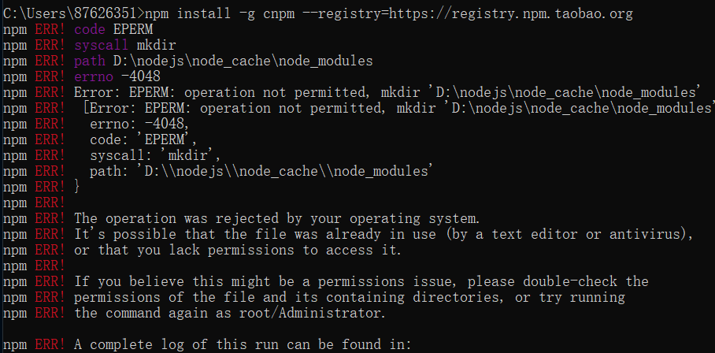
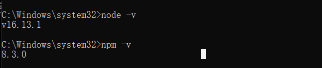

#12.23日志
##关于nodejs和node的问题
###1。node 和 npm 的安装问题
安装cnpm时出现如下问题

无法安装
按照查照方法一
设置缓存的文件夹河全局模块存放路径
设置缓存文件夹

npm config set cache “D:\nodejs\node_cache”

设置全局模块存放路径

npm config set prefix “D:\nodejs\node_global”

设置完成后，安装的全局模块就在D:\nodejs\node_global里

安装cnpm（淘宝镜像）
npm install -g cnpm --registry=https://registry.npm.taobao.org
依然报错

查照方法二
要求升级npm，发现npm升级也报错

查照原因，未开启管理员
打开管理员模式

仍然报错
重新检查node和npm安装问题
node和npm安装正确

再下载cnpm。

安装成功
###2.安装vue-cli
输入npm install -g vue-cli部分地方报错
查询原因npm版本过高
修改npm版本
将其改为 npm install npm@6.14.10 -g
重新输入npm install -g vue-cli
安装成功
###3.搭建前端项目
搭建前端输入vue init webpack wj-vue
报错

查询问题npm版本低
更新版本
运行npm run dev
报错，查照问题：找不到package.json
进入wj-vue文件，输入npm run dev
运行成功

###4.使用idea
然后选择 Static Web -> Vue.js，点击 next，输入相关参数
选择 CLI 的版本

调出终端，执行 npm install
执行出错

设置镜像

依然报错